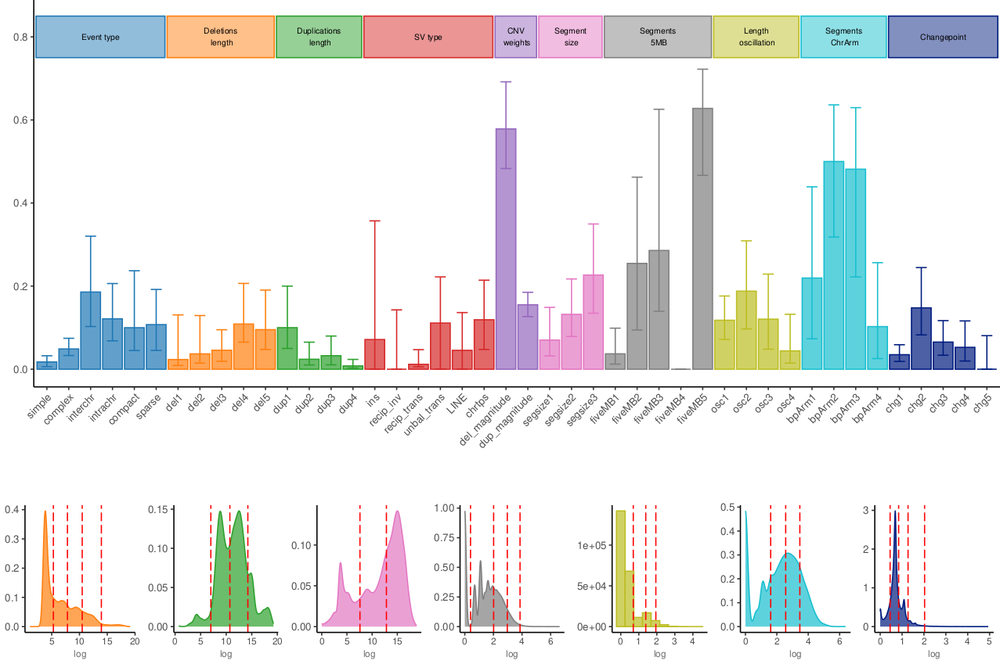
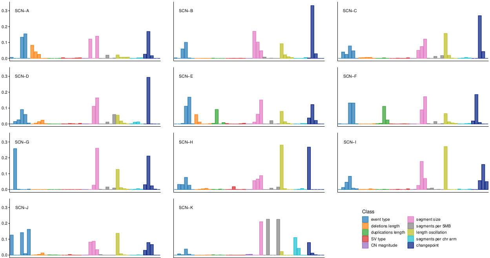
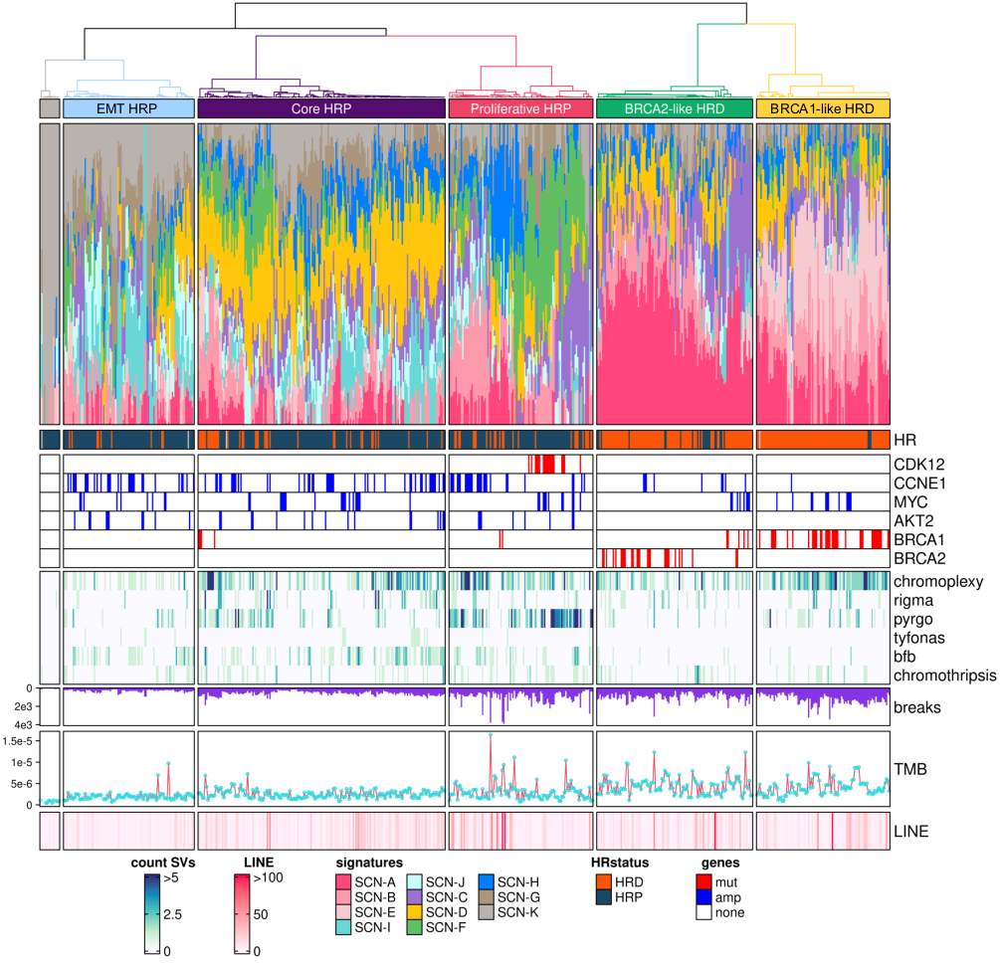

# Emerging CIN-subtypes
Discovery of ovarian cancer subtypes based on chromosomal instability signatures

This repository contains scripts and certain data files used in the "Decoding the Genomic and Functional Landscape of Emerging Subtypes in Ovarian Cancer " by Micoli et al. (2025).
To use this repository, copy-number, breakpoint and structural variation data must be obtained using the tools mentioned from the [Hartwig Medical Foundation](https://pages.github.com/) repository.

Required packages and versions can be found in the Dockerfile.

The analysis is composed of four main steps:
1. Features quantification
2. Signatures extraction and/or assignment
3. Clustering of signature activities

All the steps, with exception of the transcriptomics analysis, have been performed with and example dataset. Input files are stored in the folder `data/example` and the results from the analysis in `results`.

## Features quantification

Features calculation involves the quantification of some genomic characteristics, such as the number of segments in the genome, the amount of translocations and so on. The complete list and explanation can be found in the main article and in the *Supplementary Notes*. Among these, the continuous variables are transformed in discrete variables using specific tresholds estimated from the data (models). For this reason, there are two modalities for feature quantification: 
* pre-existing models: calculation of the features using the models from the original work (`data/discretization_models.rds`)
* *de novo* models: calculation of the models from the provided data.

#### Pre-existing models modality
Features quantification from pre-existing models can be done by running the R script `extract_features.R`. Input required: 
* sample information tsv file: data frame with "sample", "patient" and "path" columns. The "path" specifies for each sample the PURPLE and LINX output folder.
* `discretization_models.rds`: models for discretization of continuous variables 
* output folder path

The resulting file `extraction_df.tsv` contains the quantified features for each sample and can be used for *de novo* signature extraction or signature attribution.

#### *De novo* models modality
Features calculation with estimation of the models from the provided data can be carried out running the R script `denovo_models_features.R`. Input required:
* sample information tsv file: data frame with "sample", "patient" and "path" columns. The "path" specifies for each sample the PURPLE and LINX output folder.
* output folder path

The resulting file `extraction_df.tsv` contains the quantified features for each sample and can be used for *de novo* signature extraction or signature attribution. The file `denovo_models.rds` is also provided and can be used for future analysis.

#### Features overview 
It is possible to have a first overview of the calculated features by reproducing Fig. 1A from the article. To do that, run the script `FeatureR/features_summary_plot.R` with the features dataframe as input.


## Signatures
This step requires the use of [SigProfilerExtractor](https://github.com/AlexandrovLab/SigProfilerExtractor) and [SigProfilerAssignment](https://github.com/AlexandrovLab/SigProfilerAssignment). Documentation for the tools in the respective repositories.

#### Signature activity assignment
Signature activity attribution from pre-existing signatures can be run with:
```
python run_sigProfilerAssignment.py 'path/to/feature_df.tsv' 'path/to/Signatures_definition.txt' 'outhput/folder/path'
```
The input file `Signature_definition.txt` can be obtained by running SigProfilerExtractor with new data or can be found in the `data/SCN_Signatures.txt`. 

With the example data:
```
python signatures/run_sigProfilerAssignment.py '/results/extraction_df.tsv' '/data/SCN_Signatures.txt' '/results/assignment'
```
Results from this run can be found in the folder `results/assignment/`.

#### Signature extraction
To obtain de novo signatures run: 
```
python run_sigProfilerExtractor.py 'path/to/feature_df.tsv' 'outhput/folder/path'
```
With our example data:
```
python signatures/run_sigProfilerExtractor.py '/results/denovo_extraction_df.tsv' '/results/denovo_extraction'
```
Results from this run can be found in the folder `results/denovo_extraction/`. For demonstration purposes, the number of extracted signatures was limited from 1 to 10. 

#### Extra preliminary analysis
Some exploratory analysis of signature activities can be performed by running the script `signatures/signatures_activities_exploration.R`. Input required: 
* signatures definition: `data/SCN_Signatures.txt`
* activities values from signature extraction or assignment: for example `/results/assignment/De_Novo_Solution/Activities/De_Novo_Activities.txt` 

Preliminary analysis include the creation of a signature definition heatmap, per-patient analysis of sample activities, variability of signatures in the data. Results from the example data can be found in `results/preliminary`.

Additionally, it is possible to reproduce Fig.1C from the article showing signatures definition using the script `signature_plot.R`.



NB: both R scripts in the extra analysis only work with the original signatures or an equal number of signatures. 

## Clustering
Sample signature activities are then clustered to provide a robust stratification of the patients. The obtained clusters are then analysed for their stability. Main steps:
* iterative clustering
* selection of the consensus cluster attribution
* patient stability
* genomic overview of the clusters

#### Iterative clustering
Signature activities are clustered using the R package [ConsensusClusterPlus](https://bioconductor.org/packages/release/bioc/html/ConsensusClusterPlus.html). The clusteing is performed multiple times to ensure correct cluster belonging. Iterative clustering is performed by running:
```
Rscript iterative_clustering.R activities_file.txt sample_info_file.tsv output/folder/path/
```

Input:
* activities_file.txt: signature activities file from SigProfilerExtractor or SigProfilerAssignment
* sample_info_file.tsv: data frame with columns "sample" and "patient"
* output_folder

With our example data:
```
Rscript clustering/iterative_clustering.R /results/assignment/De_Novo_Solution/Activities/De_Novo_Activities.txt /data/example/sample_data.tsv /results/multiple_clustering
```
The output from each run consist of:
* clustering rds object
* diagnositc plots for each tree cut to allow an informed decision of the number of clusters
More information in ConsensusClusterPlus page.

#### Consensus clusters
After the iterative running, perform visual evaluation of the output plots from ConsensusClusterPlus to decide at which number of clusters to cut the tree. To then retrieve the prevailing cluster per sample use the script `cluster_analysis_and_selection.R`. Required input: path to the results from the iterative clustering and output folder.

Output: 
* clustering_runs_comparison.tsv : dataframe with cluster attribution for each sample for each run
* clustering_statistics.tsv: dataframe with information about the prevailing cluster, if there is a tie and with which other cluster, the fraction of runs with the prevailing cluster and if there is disagreement in the runs (more than one cluster attributed)
* clusters.tsv: final cluster attribution. The clustering object has been chosen among the mutliple runs by taking the best match with the majoity attribution cluster.

#### Stability analysis
With the final clustering, it is possible to evaluate the stability of patients. Stable patients are defined as patients with all samples clustered in the same group. Unstable patients instead have at least one discordant sample. This analysis is done using the script `stability_analysis.R`. Required input: cluster data frame from the previous step, sample data initial data frame and output folder.

Stability is split into primary and general: primary stability considers only pre-treatment samples, while general stability takes into consideration all samples. Special cases:
* if the patient has more than 6 samples and only one belongs to a different cluster, the patient is considered stable anyways
* if pre-treatment samples belong to different clusters than other phase samples, the patient is considered primary stable but not general stable
The results of this step are provided in the `clusters_with_stability.tsv` data frame.

#### Genomic overview
It is possible to reproduce Fig. 3 from the article with the script `clustering_figure.R`. Required input:
* clustering object (rds): contains the hierarchical clustering information
* activities from sigProfilerExtractor/Assignment
* metadata data frame containing:
    * HR: homologous recombination status (HRD/HRP)
    * CDK12mut: mutational status of CDK12 (mut/none)
    * CCNE1amp: copy number status of CCNE1 (amp/none)
    * MYCamp: copy number status of MYC (amp/none)
    * AKT2amp: copy number status of AKT2 (amp/none)
    * BRCA1mut: mutational status of BRCA1 (mut/none)
    * BRCA2mut: mutational status of BRCA1 (mut/none)
    * complex structural variations counts (range = 0-5): chromoplexy, rigma, pyrgo, tyfonas, bfb, chromothripsis
    * breaks: number of breakpoints in the genomes
    * TMB: tumor mutational burden value
    * LINE: LINE events (range = 0-100)

Example of running is provided using the results from the example data. Since the example dataset is only part of the original cohort, the final figure differs and the cluster names do not really reflect the true subtypes.

Original figure:



#### Transcriptomics analysis
To perform trasncriptomic characterization of the clusters it is possible to use the jupyter notebook `transcriptomics_analysis.ipynb`. Required data:
* PRISM output (documentation and info at [PRISM repo](https://bitbucket.org/anthakki/prism/src/master/)):
    * expression matrix for cancer cells 
    * additional decomposition tables (W.tsv and G.tsv)
* annotation data frame: information about the comparison groups and additional variables

The notebook allows to perform the following analysis:
* Data loading
* Cell type analysis
* Differential expression analysis (DEA)
* Transcription factor activity inference (via CollecTRI)
* Pathway activity inference (via PROGENy)
* Gene Set Enrichment Analysis (GSEA)

NB: for this step no example results are shown since expression data cannot be shared.